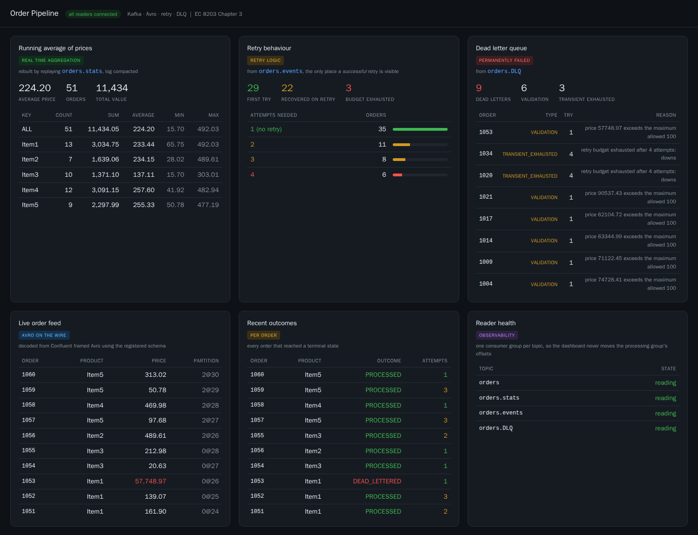

# Kafka + Avro Order Pipeline

**EC 8203 — Applied Big Data Engineering · Chapter 3 Assignment**

A Kafka pipeline that produces and consumes **order** messages serialised with
**Avro**, and that implements the three behaviours the assignment asks for:

| Requirement | Where it lives |
|---|---|
| Avro serialisation | [schemas/order.avsc](schemas/order.avsc) + Confluent Schema Registry serdes in [src/producer.py](src/producer.py) / [src/consumer.py](src/consumer.py) |
| Real-time aggregation (running average of prices) | [src/aggregator.py](src/aggregator.py), applied in [src/consumer.py](src/consumer.py), replayable via [src/stats_consumer.py](src/stats_consumer.py) |
| Retry logic for temporary failures | `process_with_retry` + `backoff_delay` in [src/consumer.py](src/consumer.py) |
| Dead Letter Queue for permanently failed messages | `DeadLetterQueue` in [src/consumer.py](src/consumer.py), read back by [src/dlq_consumer.py](src/dlq_consumer.py) |

Language: **Python 3.12** with `confluent-kafka` (librdkafka bindings + Schema
Registry Avro serdes). Everything runs from `docker compose`, so the demo is
reproducible on any machine with Docker.

---

## 1. Architecture

```
                        ┌──────────────────────┐
                        │  Schema Registry     │  subjects:
                        │  :8081               │   orders-value
                        └──────────┬───────────┘   orders.DLQ-value
                                   │ register /     orders.stats-value
                          schema id│ fetch
        ┌──────────────┐           │            ┌──────────────────────────┐
        │  producer.py │───────────┴───────────▶│        consumer.py       │
        │              │   topic: orders        │                          │
        │ random orders│   Avro-encoded         │  1. deserialise (Avro)   │
        │ ~10% poison  │   key = product        │  2. validate             │
        └──────────────┘                        │  3. process + RETRY      │
                                                │  4. running average      │
                                                └───┬──────────────┬───────┘
                                                    │              │
                                     topic: orders.DLQ      topic: orders.stats
                                     (FailedOrder Avro)     (OrderStats Avro,
                                                    │        log-compacted)
                                                    ▼
                                     ┌──────────────┐  ┌──────────────────┐
                                     │dlq_consumer  │  │ stats_consumer   │
                                     └──────────────┘  └──────────────────┘
```

Kafka runs in **KRaft mode** (no ZooKeeper), single broker, 3 partitions per
topic.

### Wire format

Avro here is *Confluent-framed*, not bare Avro files. Each message value is:

```
┌──────┬──────────────────┬──────────────────────────┐
│ 0x00 │ schema id (int32)│  Avro binary payload     │
└──────┴──────────────────┴──────────────────────────┘
  magic     big-endian        no embedded schema
```

The writer schema is registered once under the subject `<topic>-value`; the
consumer fetches it by id and decodes against it. That is what keeps the
payload small — the schema travels once, not per message.

---

## 2. Schemas

**`schemas/order.avsc`** — exactly the assignment's definition:

| Field | Type | Description |
|---|---|---|
| `orderId` | `string` | Unique identifier for the order (e.g. `"1001"`) |
| `product` | `string` | Name of the purchased item (e.g. `"Item1"`) |
| `price` | `float` | Price of the product (randomised) |

**`schemas/failed_order.avsc`** — the DLQ record. Carries the original order
plus `failureType` (`DESERIALIZATION` / `VALIDATION` / `TRANSIENT_EXHAUSTED`),
`errorMessage`, `attempts`, and the source topic/partition/offset so any dead
letter can be traced back to the exact byte range it came from.

**`schemas/order_stats.avsc`** — a snapshot of the aggregation state
(`count`, `sum`, `avgPrice`, `minPrice`, `maxPrice`), published per key so the
running average is not trapped inside the consumer process.

Subject compatibility is set to `backward`, so `orders-value` can later gain
optional fields without breaking this consumer.

---

## 3. Quick start

**Prerequisites:** Docker Desktop (with Compose v2). Nothing else — Python
runs inside the containers.

```bash
# 1. Infrastructure: Kafka + Schema Registry + Kafka UI
docker compose up -d kafka schema-registry kafka-ui

# 2. Create the three topics (idempotent; also runs automatically as a dependency)
docker compose run --rm init-topics

# 3. Terminal A - the consumer (retry + DLQ + running average)
docker compose run --rm consumer

# 4. Terminal B - the producer
docker compose run --rm producer

# 5. The web dashboard at http://localhost:18186
docker compose up -d web

# 6. Terminal C - inspect the Dead Letter Queue
docker compose run --rm dlq-viewer

# 7. Terminal D - rebuild the running averages from the compacted stats topic
docker compose run --rm stats-viewer
```

**Web dashboard: http://localhost:18186**



Six panels, one per thing the assignment asks for: the running average rebuilt
from the compacted stats topic, retry behaviour with the attempt distribution,
the dead letter queue by failure type, the live Avro decoded order feed, the
per order outcomes, and the health of each topic reader.

It holds no database. Every figure is rebuilt by consuming Kafka, which is also
a demonstration that the log compacted `orders.stats` topic really can
reconstruct state: restart the container and the whole dashboard comes back.

Kafka UI for browsing topics, messages and registered schemas:
**http://localhost:18185**

Host ports sit in a `1xxxx` block: Kafka on `19192`, Schema Registry on
`18181`, Kafka UI on `18185`. Windows reserves shifting port ranges for Hyper-V
and regenerates them on every reboot, and 9092 landed inside one. If a port
fails to bind with "an attempt was made to access a socket in a way forbidden
by its access permissions", check the current reservations with:

```bash
netsh interface ipv4 show excludedportrange protocol=tcp
```

Shut everything down (and delete the data):

```bash
docker compose down -v
```

### Running without Docker

Requires **Python 3.9–3.13** (`confluent-kafka` has no 3.14 wheels yet) and a
reachable broker at `localhost:19192`:

```bash
python -m venv .venv
source .venv/Scripts/activate     # Git Bash on Windows
pip install -r requirements.txt
export KAFKA_BOOTSTRAP_SERVERS=localhost:19192
export SCHEMA_REGISTRY_URL=http://localhost:18181
python -m src.create_topics
python -m src.consumer        # terminal A
python -m src.producer        # terminal B
python -m src.dlq_consumer    # terminal C
python -m src.stats_consumer  # terminal D
```

---

## 4. How each requirement is implemented

### 4.1 Avro serialisation

`AvroSerializer` / `AvroDeserializer` from `confluent_kafka.schema_registry.avro`,
pointed at the registry at `http://schema-registry:8081`. The producer registers
`order.avsc` on first send (`auto.register.schemas: true`); the consumer
resolves the schema by the id embedded in each message. Keys are plain strings
(the product name), which is enough to keep all orders for one product on one
partition and therefore keep per-product aggregation ordered.

### 4.2 Real-time aggregation — running average

`Aggregator` keeps only `(count, sum, min, max)` per key and updates in O(1):

```
sum_n = sum_(n-1) + price_n
avg_n = sum_n / n
```

No window of past prices is retained, so memory is bounded by the number of
distinct products, not by the length of the stream. Two aggregates are
maintained: `ALL` (global) and one per product. After every successfully
processed order the consumer prints the updated averages and publishes an
`OrderStats` record to the log-compacted `orders.stats` topic — compaction
means the topic always holds the *latest* aggregate per key, so a dashboard can
read the current state by consuming from the beginning.

Every ten orders the consumer also prints the full table (real output from a
45-order run):

```
KEY          COUNT           SUM         AVG       MIN       MAX
----------------------------------------------------------------
ALL             36       8334.76      231.52      8.22    485.68
Item1            9       2120.63      235.63     20.73    446.63
Item2            6       1427.04      237.84     73.47    390.42
Item3            7       1268.40      181.20      8.22    353.76
Item4            5       1539.86      307.97     74.12    485.68
Item5            9       1978.83      219.87     26.51    385.46
```

`src/stats_consumer.py` replays `orders.stats` from offset 0 and reproduces
exactly that table -- which is the proof that the aggregate really does survive
outside the consumer process.

### 4.3 Retry logic for temporary failures

The design turns on one distinction, in [src/errors.py](src/errors.py):

* `TransientError` — *might* succeed on a retry (downstream timeout, 503,
  connection reset). The consumer retries it.
* `PermanentError` — *cannot* succeed on a retry (bad bytes, failed validation,
  business-rule violation). Retrying it only burns the budget and blocks the
  partition, so it is dead-lettered on the first attempt.

Retries use **exponential backoff with jitter**, capped:

```
delay(attempt) = min(BASE * 2^(attempt-1), MAX) ± 30% jitter
               = 0.5s, 1s, 2s, 4s ...   (capped at 8s)
```

Jitter matters once more than one consumer is running: without it, a whole
group retries in lockstep and re-stampedes the downstream the instant it comes
back. The retry budget is `MAX_RETRIES = 3`, i.e. four attempts in total.
`max.poll.interval.ms` is raised to 10 minutes so a legitimate backoff is never
mistaken by the group coordinator for a dead consumer.

Console output during a retry:

```
  recv orderId=1043 product=Item3  price=  187.40  [orders[1]@27]
     transient failure on attempt 1/4: downstream service unavailable (simulated 503) -> retrying in 0.43s
     transient failure on attempt 2/4: downstream service unavailable (simulated 503) -> retrying in 1.18s
     recovered on attempt 3/4
     OK in 3 attempt(s) | running avg ALL = 238.91 (n=44) | Item3 avg = 201.55 (n=9)
```

### 4.4 Dead Letter Queue

A message reaches `orders.DLQ` by one of three routes, recorded in
`failureType`:

| `failureType` | Cause | Retried first? |
|---|---|---|
| `DESERIALIZATION` | Payload is not valid Avro for the registered schema | No |
| `VALIDATION` | Business rule broken (negative price, price > 10 000, empty field) | No |
| `TRANSIENT_EXHAUSTED` | Transient failure that survived all 4 attempts | Yes, 4× |

The DLQ record is itself Avro (`failed_order.avsc`) so the queue is queryable
rather than an opaque blob of text. The **original message bytes** are attached
as the Kafka header `dlq-original-value`, so a replay tool can re-inject the
exact payload without re-encoding it. The DLQ topic gets 30-day retention —
dead letters must outlive the incident that produced them.

The producer emits ~10 % deliberately invalid orders (negative or absurd
prices), so the DLQ is populated within seconds of starting the demo.

`dlq_consumer.py` reads it back with a separate consumer group, so inspecting
the DLQ never disturbs the main pipeline's offsets:

```
TIME      ORDER          PRODUCT         PRICE  TYPE                  TRY  REASON
--------------------------------------------------------------------------------------------
10:56:19  1001           Item1         -155.58  VALIDATION              1  price must be >= 0, got -155.58
10:56:24  1012           Item4          486.69  TRANSIENT_EXHAUSTED     3  retry budget exhausted after 3 attempts: ...
10:56:30  1038           Item4        85983.31  VALIDATION              1  price 85983.31 exceeds the maximum allowed 10000.00
10:56:34  <undecodable>                  -1.00  DESERIALIZATION         1  Invalid magic byte
--------------------------------------------------------------------------------------------
  total dead letters: 10
    VALIDATION                6  (60%)
    TRANSIENT_EXHAUSTED       3  (30%)
    DESERIALIZATION           1  (10%)
```

### 4.5 Delivery guarantees

* **Producer**: `acks=all` + `enable.idempotence=true` → no duplicates from
  broker-side retries, no acknowledged-but-lost writes.
* **Consumer**: `enable.auto.commit=false` and `enable.auto.offset.store=false`.
  An offset is stored only once the message has reached a *terminal* state —
  processed successfully, or safely written to the DLQ. This is **at-least-once**:
  a crash mid-retry replays the message rather than silently dropping it.
* The DLQ producer is flushed before the consumer closes, so no dead letter is
  lost on shutdown.

---

## 5. Configuration

Every knob is an environment variable ([src/config.py](src/config.py)):

| Variable | Default | Meaning |
|---|---|---|
| `KAFKA_BOOTSTRAP_SERVERS` | `localhost:9092` | Broker list. Compose sets `kafka:29092`; from the host use `localhost:19192` |
| `SCHEMA_REGISTRY_URL` | `http://localhost:8081` | Schema Registry. Compose sets `http://schema-registry:8081`; from the host use `http://localhost:18181` |
| `ORDERS_TOPIC` / `DLQ_TOPIC` / `STATS_TOPIC` | `orders` / `orders.DLQ` / `orders.stats` | Topic names |
| `MESSAGE_COUNT` | `0` (unlimited) | How many orders to produce |
| `PRODUCE_INTERVAL_SEC` | `1.0` | Delay between orders |
| `POISON_RATE` | `0.10` | Fraction of deliberately invalid orders |
| `TRANSIENT_FAILURE_RATE` | `0.20` | Simulated downstream flakiness |
| `MAX_RETRIES` | `3` | Retries after the first attempt |
| `RETRY_BASE_DELAY_SEC` / `RETRY_MAX_DELAY_SEC` | `0.5` / `8.0` | Backoff curve |
| `MAX_ALLOWED_PRICE` | `10000.0` | Validation threshold |
| `DLQ_ONCE` / `STATS_ONCE` | unset | Drain the topic, print, and exit instead of following |
| `RANDOM_SEED` | unset | Set it for a reproducible run |

Example — a short, fully deterministic run for a screenshot:

```bash
MESSAGE_COUNT=40 PRODUCE_INTERVAL_SEC=0.3 RANDOM_SEED=42 docker compose run --rm producer
```

---

## 6. Live demo script

See [docs/DEMO.md](docs/DEMO.md) for the step-by-step walkthrough used in the
demonstration, including how to force each failure path on demand.

---

## 7. Repository layout

```
kafka-avro-orders/
├── docker-compose.yml        Kafka (KRaft) + Schema Registry + Kafka UI + app services
├── Dockerfile                Python 3.12 image shared by producer/consumer/DLQ viewer
├── requirements.txt
├── schemas/
│   ├── order.avsc            the assignment's order schema
│   ├── failed_order.avsc     DLQ record with failure context
│   └── order_stats.avsc      running-average snapshot
├── src/
│   ├── config.py             all configuration, read from the environment
│   ├── create_topics.py      idempotent topic creation
│   ├── producer.py           Avro producer (+ deliberate poison messages)
│   ├── consumer.py           retry + DLQ + running average
│   ├── aggregator.py         O(1) incremental running average
│   ├── errors.py             transient vs permanent failure taxonomy
│   ├── dlq_consumer.py       DLQ inspector, with a breakdown by failure type
│   └── stats_consumer.py     rebuilds the running averages from orders.stats
└── docs/DEMO.md              live demonstration script
```
